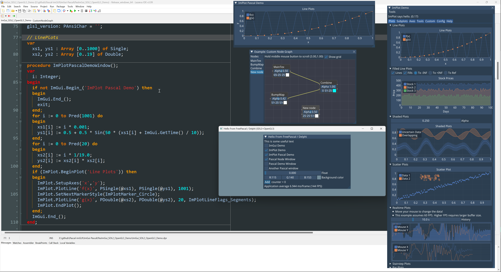
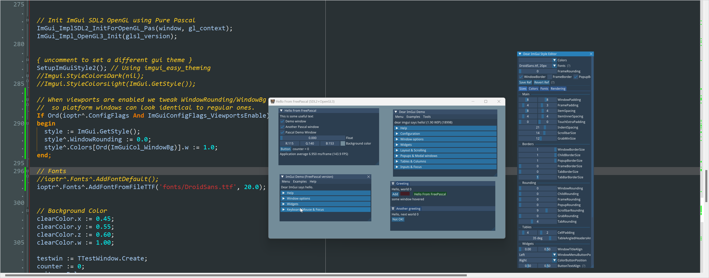
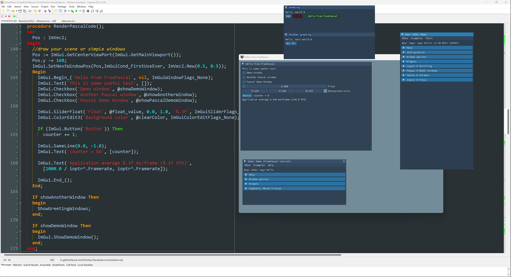
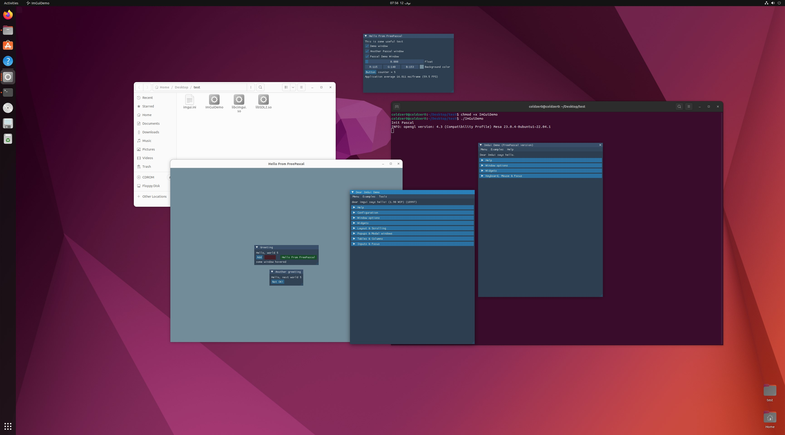
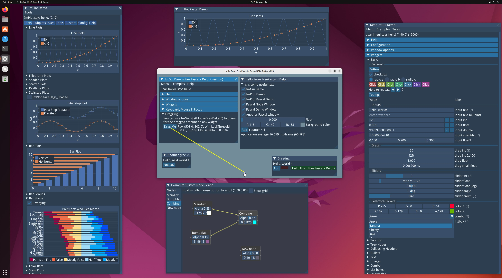

# ImGui-Pascal

FreePascal / Delphi bindings for dear [ImGui](https://github.com/ocornut/imgui) with docking v1.90.0

The Binding is based on [cimgui](https://github.com/cimgui/cimgui)
> cimgui is c-api for imgui (https://github.com/ocornut/imgui) Look at: https://github.com/cimgui for other widgets.

## Screenshots

#### Running on Windows

##### ImPlot

 

##### FreePascal

 

#### Delphi

 

#### Running on Linux (FreePascal)

##### ImPlot

## Building
- Tested with FreePascal 3.2 and later.
- Tested with Delphi 12.0

## Usage
It should be almost 1 to 1 as if you are using C++ ImGui   
Check the demo project for more info.

### TODO
- Add missing APIs to our `ImGui Class`
- Add missing APIs to our `ImPlot Class`
- Add record helpers for some records like `ImGuiIO` & all `ImVector_xxx` records
- Add Support for [cimnodes](https://github.com/cimgui/cimnodes) or [cimnodes_r](https://github.com/cimgui/cimnodes_r)
- Test on Mac

### In Progress
- Added APIs for [cimplot](https://github.com/cimgui/cimplot)

## Acknowledgements & Resources :

#### Inspired by the work of David Pethes [imgui-pas](https://github.com/dpethes/imgui-pas) 

#### Used Projects :
- [Chet](https://github.com/neslib/Chet)
- [cimgui](https://github.com/cimgui/cimgui)
- [imgui-pas](https://github.com/dpethes/imgui-pas)
- [SDL2 Project](https://github.com/libsdl-org/SDL/tree/SDL2)
- [SDL2-for-Pascal](https://github.com/PascalGameDevelopment/SDL2-for-Pascal)
- [Blueicaro/GLFW](https://github.com/Blueicaro/GLFW)
- [Glad Generator](https://glad.dav1d.de/#language=pascal&specification=gl&api=gl%3D4.6&api=gles1%3D1.0&api=gles2%3D3.2&api=glsc2%3D2.0&profile=compatibility&loader=on)
- [ChatGPT](https://chat.openai.com)

### Change log
##### 29/11/2023
- A Full rework for the APIs 
- Adding ImPlot Support ( APIs Still in progress )
- Support windows 32bit

##### 17/11/2023
- Allow static linking on windows with FPC ( no static for Delphi :P )
- And wrote the entire `OpenGL3 renderer` in `Pure-Pascal` 
- Fixing a bug if you try to compile on Linux 

##### 15/11/2023
- Sync With Latest `ImGui update v1.90.0`
- Disabling Floating-Point Exceptions for good
- Updating the code to `support Delphi` & FreePascal

##### 13/11/2023
- Init Release
- Added Fonts APIs in ImFontAtlas helper

## With ❤️ From Home.