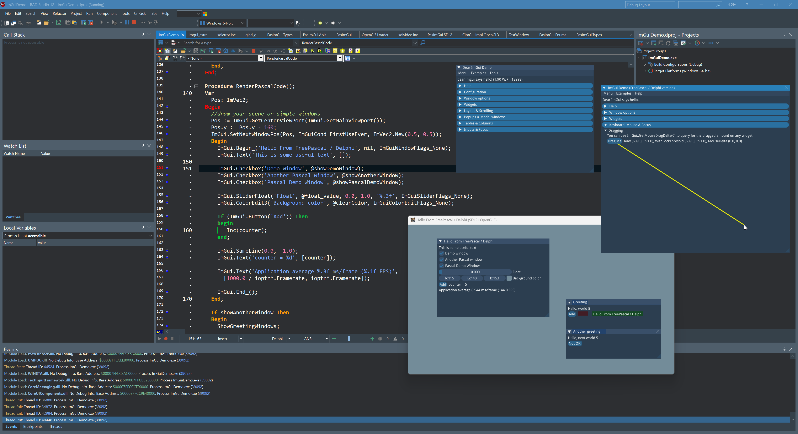

# ImGui-Pascal

FreePascal bindings for dear [ImGui](https://github.com/ocornut/imgui) with docking v1.99

The Binding is based on [cimgui](https://github.com/cimgui/cimgui)
> cimgui is c-api for imgui (https://github.com/ocornut/imgui) Look at: https://github.com/cimgui for other widgets.

## Screenshots

#### Running on Windows

 

#### Running on Linux

## Building
Tested with FreePascal 3.3.x and later.

## Usage
It should be almost 1 to 1 as if you are using C++ ImGui   
Check the demo project for more info.

### TODO
- Add Support for [cimplot](https://github.com/cimgui/cimplot)
- Add Support for [cimnodes](https://github.com/cimgui/cimnodes)
- Add Support for [cimnodes_r](https://github.com/cimgui/cimnodes_r)
- Test on Mac
- Add missing APIs to our `ImGui Class`
- Add record helpers for some records like `ImGuiIO` & all `ImVector_xxx` records

## Acknowledgements & Resources :

#### Inspired by the work of David Pethes [imgui-pas](https://github.com/dpethes/imgui-pas) 

#### Used Projects :
- [cimgui](https://github.com/cimgui/cimgui)
- [SDL2 Project](https://github.com/libsdl-org/SDL/tree/SDL2)
- [SDL2-for-Pascal](https://github.com/PascalGameDevelopment/SDL2-for-Pascal)
- [imgui-pas](https://github.com/dpethes/imgui-pas)
- [ChatGPT](https://chat.openai.com)

## With ❤️ From Home.